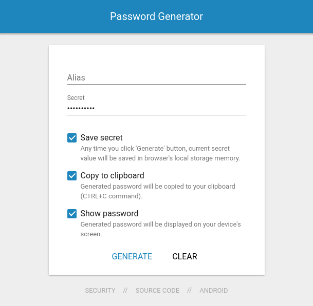

# Password Generator

Progressive web app for password simple password generation on the fly built using Web Components and the Polymer library.

- **Secure** - Everything is done inside your browser, no data leave your device, either to our servers, or anywhere else.
- **Easy to use** - Well designed and polished UI for both desktops and mobile devices.
- **Helpful** - No need to remember lots of complicated passwords to be secure.
- **Fast** - Your password is generated instantly.

 

Visit https://password-generator.webapp.sk to see the app in action.

## Requirements

- npm
- bower
- polymer-cli

## Installation

Install bower dependencies:

    $ bower install

## Development mode

Run the app in development mode in your local browser:

```
$ polymer serve
```

## Production build

```
$ polymer build
```

This will create a `build/` folder with `bundled/` and `unbundled/` sub-folders containing a bundled (Vulcanized) and unbundled builds, both run through HTML, CSS, and JS optimizers.

You can serve the built versions by giving `polymer serve` a folder to serve from:

```
$ polymer serve build/bundled
```


